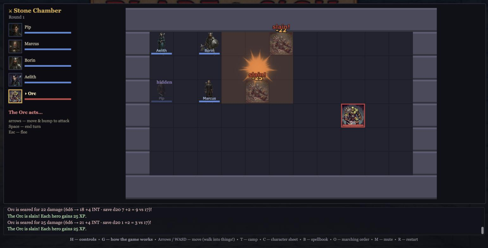

```
 ██████╗ ██╗      █████╗ ██████╗ ███████╗       ██╗       ███████╗██╗ ██████╗ ██╗██╗
 ██╔══██╗██║     ██╔══██╗██╔══██╗██╔════╝       ██║       ██╔════╝██║██╔════╝ ██║██║
 ██████╔╝██║     ███████║██║  ██║█████╗      ████████╗    ███████╗██║██║  ███╗██║██║
 ██╔══██╗██║     ██╔══██║██║  ██║██╔══╝      ██╔═██╔═╝    ╚════██║██║██║   ██║██║██║
 ██████╔╝███████╗██║  ██║██████╔╝███████╗    ╚██████║     ███████║██║╚██████╔╝██║███████╗
 ╚═════╝ ╚══════╝╚═╝  ╚═╝╚═════╝ ╚══════╝     ╚═════╝     ╚══════╝╚═╝ ╚═════╝ ╚═╝╚══════╝
```

# ▶ PLAY NOW: **https://usmcm1a1.github.io/Blade-and-Sigil/**

No download, no install. Open the link in a desktop browser (Chrome, Firefox,
Safari or Edge) and press **Create New Party**. Your party and your run save in
that browser, so come back to the same link to continue the descent.



## What it is

**Blade & Sigil** is an old-school computer RPG in the spirit of the classic
party dungeon crawls: a party of four heroes, a map to explore, tactical
turn-based battles on a grid, and a long, lethal road to level 20.

- **Explore twenty floors of procedural dungeon**, each deeper floor darker
  than the last, with traps, secret doors, treasure vaults, and a town above
  ground to rest, shop and pray in.
- **Build the party you want** from five races and seven classes. Roll 3d6
  for abilities, arrange the scores, choose a marching order.
- **Fight tactical battles** where every to-hit roll and every bonus is shown
  by name. Bump a monster to swing, cast spells and shoot arrows at range,
  flee and be chased.
- **Forge your class at level 5.** Every class forks into two paths with
  their own passive, a signature move at level 10, a capstone at level 15, and
  a personal Rite at level 20 where you name your own power.
- **Meaningful risk.** Rest costs rations, the night can be ambushed, the
  temple charges for a revival, and a party wipe ends the run. Level 20 is
  meant to be earned.
- **A bestiary of 66 monsters** from giant rats to liches, dragons and
  elementals, each with painted art, and a mad Overlord waiting at the bottom
  for a party that reaches level 20.

## Races

| Race | Gift | Classes open to them |
|---|---|---|
| Human | +1 Strength | Warrior, Priest, Wizard |
| Dwarf | +1 Constitution, a bonus to all saves | Warrior, Stoneshaper |
| High Elf | +1 Intelligence | Wizard, Spellblade |
| Wood Elf | +1 Dexterity, a knack for secret doors | Warrior |
| Halfling | +1 Dexterity, a bonus to thief skills | Thief |
| Half-Elf | +1 to any one ability of your choice | Ranger |

## Classes

| Class | The idea | Paths at level 5 |
|---|---|---|
| Warrior | Best hit die, any weapon, any armor, extra attacks as you climb. | Way of the Blade (the Barbarian) · Way of the Shield (the Knight) |
| Priest | Divine magic: healing, wards, and prayers that turn the undead. Knows every common prayer. | The Shepherd's Crook (the Prelate) · The Drawn Sword (the Knight Templar) |
| Wizard | Arcane magic from a spellbook: fire, frost, lightning and sleep. Studies new pages and copies scrolls. | The Spellbook (the Archmage) · The Raw Gift (the Stormcaller) |
| Thief | Starts every fight hidden, finds traps and secret doors, and can assassinate an unaware foe. | Blade Work (the Assassin) · Shadows (the Burglar) |
| Spellblade | A high-elf half-caster who sings stances and surges onto their own blade. | Bladesong (the Blade Dancer) · Wardsong (the Spell Singer) |
| Stoneshaper | A dwarven half-caster who wears the mountain: skin of stone, unyielding, sharing fortitude. | Bulwark (the Mountain's Heart) · Hearthstone (the Deep Root) |
| Ranger | A half-elf hunter with favored enemies, the only class that fights with two blades. | Way of the Wolf (the Strider) · Way of the Hawk (the Deadeye) |

## Controls, briefly

Arrow keys or WASD move the party; walk into a door, a chest or a monster to
act on it. **Space** searches, **T** makes camp, **C** opens the character
sheet, **B** the spellbook, **O** the marching order. In battle: bump to
attack, **C** for spells and battle arts, **F** to shoot, **I** for potions,
**W** to swap weapons, **Space** to end the turn, **Esc** to flee. Press **H**
in game for the full list and **G** for how the systems work.

## For the curious

The game is plain HTML, JavaScript and Canvas with no frameworks. The
engine lives in `bladesigil/engine/`; every monster, spell, item, class, floor
and sound is plain JSON in `bladesigil/data/`, made to be edited by hand. The
design document is `bladesigil/Fantasy_RPG_Game_design_doc_v3.md`. To run it
locally, double-click `bladesigil/Play.command` (Mac) or `Play.bat` (Windows).
